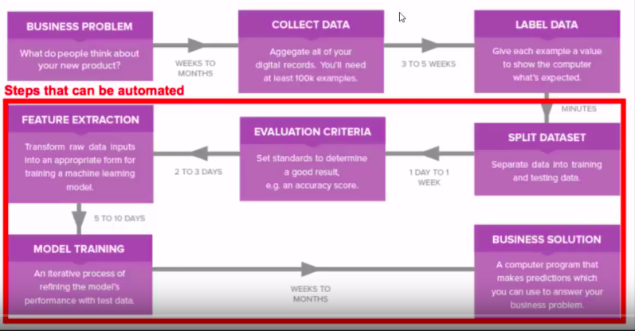

# Reflex ML
> A tool to automate your Machine Learning

## Motivation
The typical Machine Learning workflow is as follows:

Business Problem -> Collect Data -> Label Data -> Split Dataset -> Select Evaluation Metrics
-> Feature Extraction -> Model Selection -> Deployment

The steps from "Split Dataset" can be automated and that is what ReflexML aims to do. It lets you concentrate on
your data and let it do the heavy-lifting of Machine Learning for you.

## Release History

* 0.0.1
    * Work in progress
